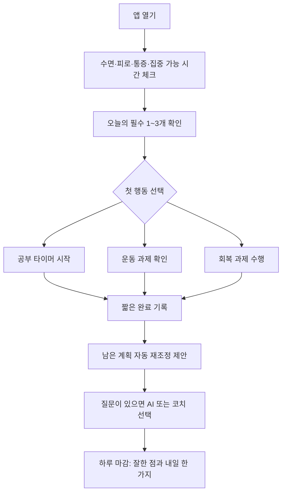
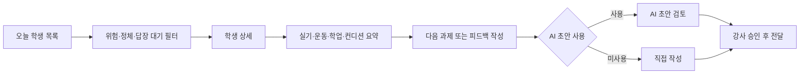
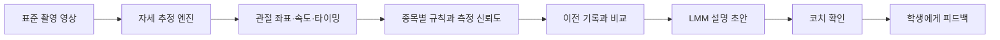
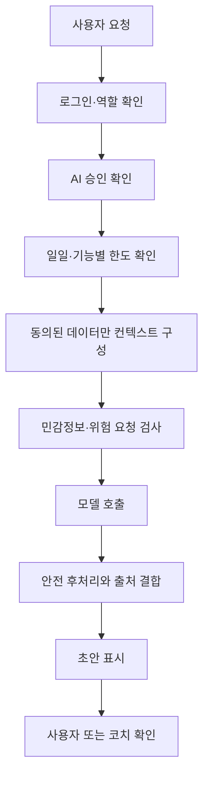

# RP APP 개발 프로젝트 보고서

- 문서 버전: 0.2
- 작성일: 2026-08-01
- 최근 반영: 학부모 학생 선택 공개 권한, 공부 타이머 조사 원칙, RP APP 캘린더·일정 도우미
- 프로젝트명: RP APP 개발 프로젝트
- 제품 성격: 체대입시 학생의 공부·운동·회복·상담을 함께 관리하는 역할 기반 앱
- 기준 저장 위치: `E:\CodexProjects\rp-app-project`
- 참고 자산: RePERFORMANCE 홈페이지, 체대입시 정보 허브, 기존 RP 계정·AI 승인 기반, NORE 트레이너 기능 분석
- 중요한 경계: NORE API 호출, webhook, 자동 데이터 전송은 사용하지 않음

---

## 1. 경영진 요약

RP APP이 해결해야 하는 문제는 단순한 일정 관리나 운동 기록 부족이 아닙니다.

체대입시 학생은 같은 날에 다음 요구를 동시에 받습니다.

- 학교 수업과 내신 공부
- 수능 또는 면접 준비
- 체대입시 실기 훈련
- 기록 측정과 약점 보완
- 부상 및 피로 관리
- 목표 대학과 전형 확인
- 부모와 강사의 기대
- 스스로 계획을 지켜야 한다는 압박

의욕이 강한 학생일수록 계획을 더 많이 세우고, 운동으로 피곤한 날에도 공부량을 채우지 못했다는 죄책감을 느끼기 쉽습니다. 결국 문제는 의지 부족이 아니라 **서로 다른 종류의 부담을 한 학생이 혼자 조정해야 하는 구조**에 있습니다.

RP APP의 목표는 학생에게 더 많은 일을 시키는 것이 아닙니다.

> 오늘 무엇을 해야 하는지 줄여주고, 지친 날에는 계획을 조정해주며, 공부와 운동이 함께 이어지도록 코치·학생·학부모가 같은 방향을 보게 만드는 것.

따라서 제품은 다음 네 가지를 핵심으로 합니다.

1. **통합 계획**: 공부, 운동, 회복, 입시 일정을 한 계획 안에서 조정
2. **실행 단순화**: 학생은 오늘 할 일만 보고 바로 시작
3. **변화 기록**: 공부시간, 실기기록, 운동, 컨디션의 관계를 장기적으로 확인
4. **사람 중심 AI**: AI는 계획과 질문을 정리하지만, 코치와 보호자의 판단을 대체하지 않음

첫 제품은 모바일 앱처럼 설치할 수 있는 PWA로 시작하는 것이 적합합니다. 학생·강사·학부모는 같은 서비스에 로그인하지만 서로 다른 화면과 권한을 사용합니다. 앱은 공개 홈페이지와 분리하고, NORE와도 기술적으로 완전히 분리합니다.

---

## 2. 프로젝트의 출발점

### 2.1 창업자 경험에서 확인된 실제 문제

이 프로젝트의 출발점은 다음 경험입니다.

- 공부와 운동을 모두 잘하고 싶었다.
- 직접 계획하고 관리하려 했지만 현실적으로 어려웠다.
- 운동 후 피로한 상태에서 공부까지 해야 한다는 압박이 컸다.
- 계획을 지키지 못하면 능력이나 의지의 문제로 받아들이게 됐다.
- 도움을 요청하기 전까지 현재 상태를 객관적으로 정리하기 어려웠다.

이 경험은 제품 설계에서 매우 중요합니다. 학생의 실패를 의지 부족으로 판단하는 시스템을 만들면 안 됩니다. 앱은 미완료를 벌점처럼 쌓는 도구가 아니라, **현재 사용할 수 있는 에너지 안에서 다음 행동을 다시 설계하는 도구**여야 합니다.

### 2.2 문제 정의

현재 체대입시 준비는 대체로 다음처럼 분리되어 있습니다.

| 영역 | 일반적인 관리 방식 | 문제 |
| --- | --- | --- |
| 공부 | 플래너, 타이머, 학원 | 운동 피로와 일정이 반영되지 않음 |
| 운동 | 체대입시 학원, PT, 메모 | 학업량과 시험 일정을 알기 어려움 |
| 실기 기록 | 종이 기록, 메시지, 엑셀 | 측정 조건과 컨디션이 분리됨 |
| 대학 정보 | 검색, 카페, 홈페이지 | 학생 개인 상황과 연결되지 않음 |
| 식단·회복 | 학생 개인 판단 | 피로·수면·통증과 계획이 연결되지 않음 |
| 멘탈 | 혼자 참거나 주변에 단편적으로 이야기 | 압박이 커진 뒤에야 발견됨 |
| 학부모 소통 | 전화, 메시지 | 너무 적게 알거나 지나치게 개입하게 됨 |

RP APP은 이 정보를 모두 한 화면에 쌓는 것이 아니라, 같은 데이터가 각 역할에 필요한 만큼만 보이도록 재구성합니다.

### 2.3 제품이 해결할 핵심 질문

학생이 앱을 열었을 때 다음 질문에 빠르게 답할 수 있어야 합니다.

1. 오늘 반드시 해야 하는 일은 무엇인가?
2. 지금 내 몸 상태에서 이 계획이 가능한가?
3. 운동 후 공부를 어떻게 나누면 되는가?
4. 현재 실기 기록과 성적이 어떤 방향으로 변하고 있는가?
5. 힘들거나 막힐 때 누구에게 어떤 질문을 해야 하는가?

---

## 3. 제품 정의

### 3.1 한 문장 정의

**RP APP은 체대입시 학생이 공부와 운동을 함께 지속할 수 있도록 오늘의 실행, 기록, 회복, 상담을 연결하는 관리 앱입니다.**

### 3.2 제품 약속

- 학생에게는 혼자 모든 것을 계획하지 않아도 되는 안도감을 제공합니다.
- 강사에게는 학생의 기록과 컨디션을 바탕으로 다음 행동을 정할 수 있는 운영 도구를 제공합니다.
- 학부모에게는 감시가 아니라 필요한 변화와 위험 신호를 이해할 수 있는 요약을 제공합니다.

### 3.3 제품이 아닌 것

RP APP은 다음 시스템이 아닙니다.

- 합격을 보장하거나 공식 합격 여부를 판정하는 시스템
- 의료 진단 또는 재활 처방 시스템
- 심리 진단·치료 또는 위기상담 대체 시스템
- 학생의 하루를 감시하는 위치·화면 추적 시스템
- 공부시간이나 운동량으로 학생을 순위화하는 경쟁 서비스
- NORE를 복제하거나 NORE 데이터를 자동으로 가져오는 시스템
- 홈페이지에 모든 기능을 얹은 거대한 공개 포털

---

## 4. 제품 원칙

### 원칙 1. 더 시키기보다 우선순위를 줄인다

학생 첫 화면의 필수 과제는 최대 3개를 권장합니다. 나머지는 선택 과제로 분리합니다.

### 원칙 2. 미완료를 실패로 표현하지 않는다

미완료 과제는 자동으로 계속 누적하지 않습니다. 다음 날로 넘길지, 줄일지, 취소할지 다시 결정합니다.

### 원칙 3. 피로와 통증이 계획을 바꿀 수 있어야 한다

수면, 피로, 통증, 집중 가능 시간을 입력하면 운동과 공부 계획의 강도를 조절합니다.

### 원칙 4. 기록은 평가보다 조정에 사용한다

학생 기록은 벌점, 비교, 압박보다 훈련량과 회복의 균형을 찾는 데 사용합니다.

### 원칙 5. AI와 사람의 역할을 분리한다

- AI: 정보 정리, 질문 정리, 초안, 패턴 발견
- 강사: 운동 계획, 위험 판단, 기록 해석, 상담
- 학생: 실행 가능 여부와 체감 상태 입력
- 학부모: 지원과 일정·진행 상태 확인

### 원칙 6. 학생의 자기결정권을 보장한다

학생은 AI 사용 여부, 학부모에게 공개되는 정보 범위, 알림 강도를 확인할 수 있어야 합니다. 미성년자의 법적 동의 범위는 별도로 설계합니다.

### 원칙 7. 한 화면에는 하나의 주요 행동만 둔다

긴 대시보드와 과도한 카드 배열을 피합니다. 학생이 생각해야 할 선택지를 줄입니다.

---

## 5. 사용자와 역할

### 5.1 학생

**주요 목적**

- 오늘 할 일을 확인하고 바로 시작
- 공부와 운동을 무리 없이 병행
- 실기·성적·컨디션의 변화를 확인
- 질문을 정리해 AI 또는 코치에게 요청

**기본 권한**

- 본인 일정과 과제 확인
- 공부 타이머 사용
- 운동·실기·식단·컨디션 기록
- 허용된 기록과 피드백 확인
- 코치에게 메시지
- 승인된 경우에만 AI 사용

### 5.2 강사

**주요 목적**

- 학생의 오늘 계획 배정
- 실기·훈련·컨디션 변화 파악
- 기록 정체나 위험 신호 확인
- 학생과 학부모에게 필요한 피드백 전달
- AI 초안 검토와 사용량 관리

**기본 권한**

- 담당 학생 데이터 접근
- 운동·측정 계획 작성
- 실기 기록 검증
- 공개 범위가 허용된 학업 요약 확인
- 상담 기록과 다음 행동 관리
- AI 승인 요청 또는 사용 상태 확인

### 5.3 학부모

**주요 목적**

- 코치에게 필요한 문의를 전달
- 학생이 자발적으로 공개한 범위에서만 진행 상황을 이해
- 과도한 압박이나 실시간 감시 없이 필요한 지원 제공

**기본 권한**

- 문의 메시지

**학생 선택 공개 권한**

학생 화면의 `부모님에게 공개하고 싶은 정보`에서 다음 항목을 각각 선택한 경우에만 학부모에게 표시합니다.

- 출결 확인
- 계약·결제 진행 상태
- 학업 요약
- 실기 기록과 변화 요약

네 항목은 모두 기본값을 `비공개`로 시작합니다. 학생은 항목별로 공개를 켜거나 철회할 수 있고, 변경 시점과 변경 주체를 감사 기록에 남깁니다. 실제 서비스에서는 미성년자 계약과 법정대리인 고지 의무를 법률·운영 검토한 뒤 학생 선택으로 제한할 수 없는 예외 범위를 별도로 정의합니다.

**기본 비공개 항목**

- 학생과 코치의 전체 대화
- 학생의 개인 일기와 멘탈 기록 원문
- 민감한 건강·상담 메모
- AI 질문 원문

### 5.4 관리자

- 계정과 역할 승인
- 학생·학부모·강사 연결
- AI 사용 승인과 일일 한도
- 개인정보 동의와 보관기간
- 보안 이벤트와 감사 로그
- 공식 입시 데이터 갱신 상태
- 서비스 운영 설정

---

## 6. 권장 정보 구조

학생용 모바일 하단 내비게이션은 네 개로 제한합니다.

| 내비게이션 | 핵심 질문 | 포함 기능 |
| --- | --- | --- |
| 오늘 | 지금 무엇을 해야 하는가? | 오늘 할 일, 일정, 컨디션, 타이머 |
| 분석 | 내 몸과 기록은 어떻게 변하는가? | 정적·동적 자세, 실기 변화, 비교 |
| 상담 | 지금 무엇을 물어봐야 하는가? | 입시, 운동, 식단, 멘탈, 코치 메시지 |
| 기록 | 무엇을 해왔는가? | 운동, 실기, 공부, 식단, 컨디션 |

강사와 학부모는 같은 내비게이션을 사용하지 않습니다.

### 강사 내비게이션

- 오늘
- 학생
- 일정
- 소통
- 관리

### 학부모 내비게이션

- 문의
- 학생이 공개한 항목이 있을 때만 해당 메뉴를 조건부 노출

---

## 7. 핵심 사용자 흐름

### 7.1 학생의 하루



### 7.2 운동 후 지친 날

1. 학생이 피로도와 현재 집중 가능 시간을 입력합니다.
2. 앱은 원래 계획과 실제 상태의 차이를 보여줍니다.
3. 공부 과제를 다음 세 가지로 나눕니다.
   - 오늘 반드시 해야 하는 최소 과제
   - 컨디션이 괜찮으면 하는 선택 과제
   - 다음 날로 안전하게 옮길 과제
4. 20~30분의 짧은 집중 블록을 우선 제안합니다.
5. 완료하지 못한 양보다 실행한 최소 행동을 기록합니다.
6. 반복적으로 피로가 높으면 강사에게 훈련량 검토 신호를 보냅니다.

### 7.3 강사의 관리 흐름



### 7.4 학부모의 확인 흐름

1. 주간 요약을 확인합니다.
2. 출석, 공부 실행, 실기 변화, 컨디션 추세를 간단히 봅니다.
3. 코치가 표시한 지원 요청을 확인합니다.
4. 필요한 경우 코치에게 문의합니다.

학부모에게 일별 미완료 과제를 모두 보여주면 압박이 커질 수 있으므로, 기본값은 주간 추세와 코치 요약으로 제한합니다.

---

## 8. 기능 상세

### 8.1 오늘 할 일

**구성**

- 오늘 날짜와 중요한 D-day
- 컨디션 체크
- 오늘 필수 과제 최대 3개
- 선택 과제
- 다음 수업
- 공부 타이머 시작
- 코치 피드백
- 하루 마감

**과제 종류**

- 공부
- 운동
- 실기 측정
- 회복
- 식단
- 입시 준비
- 상담 준비

**과제 정보**

- 제목
- 예상 소요시간
- 중요도
- 에너지 요구 수준
- 마감일
- 배정자
- 완료 기준
- 미완료 시 처리 방식

### 8.2 컨디션 기반 일일 계획

학생은 하루 시작 또는 운동 후 다음을 짧게 입력합니다.

- 수면 시간과 수면 만족도
- 피로도
- 통증 여부와 부위
- 스트레스
- 현재 집중 가능한 시간
- 오늘 가능한 운동 강도

앱은 이를 이용해 하루를 세 가지 모드로 제안합니다.

| 모드 | 조건 예시 | 계획 방향 |
| --- | --- | --- |
| 정상 | 회복 양호, 통증 없음 | 예정된 공부·운동 계획 수행 |
| 조정 | 피로 높음, 시간이 부족함 | 필수 과제 축소, 짧은 집중 블록 |
| 회복 | 통증 또는 극심한 피로 | 운동 강도 검토, 회복과 코치 확인 우선 |

이 모드는 의료 판단이 아니라 일정 조정 보조입니다. 통증이나 위험 신호는 강사와 의료 전문가 확인으로 연결합니다.

### 8.3 공부 타이머

**기본 기능**

- 과목 선택
- 공부 목표 한 줄
- 25/5, 50/10, 90/20 집중·휴식 프리셋과 직접 설정
- 집중·휴식 자동 전환
- 앱이 백그라운드에 있거나 다시 열려도 종료 시각 기준으로 시간 보정
- 중단 사유 선택
- 완료 후 집중도 자가평가
- 과목별 일·주간 누적시간
- 계획 시간과 실제 수행시간 비교
- 시험 D-day와 과목별 일정 연결
- 세션 자동 기록과 수동 보정

**설계 원칙**

- 카메라 감시, 화면 감시, 위치 추적을 사용하지 않음
- 타이머를 오래 켠 순서로 순위를 만들지 않음
- 다른 학생과 비교하거나 강제 스트릭을 노출하지 않음
- 운동 직후에는 짧은 블록을 기본 추천
- 타이머 중단을 실패로 표시하지 않음
- 실제 수행시간과 체감 집중도를 함께 기록
- 타이머 화면에는 현재 과목, 한 줄 목표, 남은 시간과 핵심 제어만 표시

공부 타이머 앱 조사에서 반복적으로 확인되는 과목별 기록, 유연한 집중·휴식 길이, 자동 세션 기록, 주간 흐름, 캘린더 기반 계획은 채택합니다. 경쟁 순위, 과도한 통계, 광고성 방해, 감시 기능은 RP APP의 디지털 피로도 감소 목표와 맞지 않아 제외합니다.

### 8.4 운동기록

- 운동명
- 세트, 반복, 중량, 거리, 시간
- RPE 또는 체감강도
- 통증과 불편감
- 사진·영상
- 코치 피드백
- 계획 대비 수행 여부
- 기록 공개 범위

학생이 직접 입력하거나 강사가 수업 기록으로 남길 수 있습니다. 같은 내용을 두 번 입력하지 않도록 기록의 작성자와 최종 기준을 명확히 합니다.

### 8.5 실기 종목 기록

**기본 데이터**

- 종목명
- 기록 값과 단위
- 측정일
- 성별 기준
- 측정 장소와 장비
- 측정 거리와 방식
- 시도 횟수
- 최고기록 또는 평균
- 컨디션
- 코치 확인 여부

**중요 원칙**

- 종목명이 같아도 측정 방식이 다르면 같은 기록으로 비교하지 않음
- 대학 공식 기준과 훈련 측정 기록을 구분
- 기록 변화와 함께 훈련량, 피로, 통증을 볼 수 있게 함

### 8.6 정적 자세분석

**촬영**

- 정면, 측면, 후면
- 전신 촬영 가이드
- 카메라 높이와 거리 안내
- 얼굴 모자이크 기본값
- 촬영 전 동의

**분석**

- 관절 랜드마크 검출
- 어깨·골반 기울기
- 무릎·발목 정렬
- 몸통 중심 이동
- 측면 머리·몸통·골반 위치
- 이전 촬영과 변화 비교

**출력**

- 측정 신뢰도
- 관찰된 차이
- 코치가 확인할 항목
- 촬영 조건이 달라 비교가 어려운 경우의 경고
- 의료 진단을 대체하지 않는다는 고지

### 8.7 동적 자세분석

동적 분석은 LMM만으로 만들지 않습니다. 검증된 자세 추정 엔진으로 관절 좌표를 계산하고, 규칙 기반 지표와 코치 검토를 거친 뒤 LMM이 설명을 작성합니다.



**MVP 원칙**

- 처음에는 2~3개의 지정 동작만 지원
- 촬영 각도와 기준을 표준화
- 영상만 보고 거리·시간을 임의 추정하지 않음
- 거리 측정은 보정 마커 또는 코치 입력값을 기준으로 함
- 분석 불가 영상은 억지로 결과를 만들지 않음

**후보 동작**

- 스쿼트 또는 착지 동작
- 제자리멀리뛰기 기술 구간
- 메디신볼 던지기 준비·방출 동작

정확한 MVP 동작은 실제 수업에서 촬영이 쉽고 코치가 반복해서 평가할 수 있는 종목을 기준으로 확정해야 합니다.

### 8.8 입시상담

**입력**

- 학년
- 수시·정시 준비 방향
- 내신과 모의고사 성적
- 목표 대학과 학과
- 대학별 실기 종목
- 현재 실기 기록
- 지원 지역과 조건
- 상담 질문

**출력**

- 현재 정보 요약
- 부족한 입력 항목
- 목표 대학별 확인할 공식 자료
- 수시·정시 준비 우선순위
- 성적과 실기 보완 항목
- 코치 상담 때 물어볼 질문
- 자료 기준일과 출처

**금지 표현**

- 합격 보장
- 확정 합격률
- 공식 입시 판정
- AI가 지원 대학을 최종 결정한다는 표현

가능성 또는 시뮬레이션을 제공할 경우 입력값, 데이터 연도, 불확실성, 학생부·면접 등 미반영 요소를 함께 표시해야 합니다.

### 8.9 운동상담

- 현재 운동 계획 설명
- 동작 수행 질문
- 기록 정체 원인 정리
- 수업 전 질문 준비
- 회복·훈련량 점검
- 코치 상담용 요약

AI는 강사가 배정한 프로그램을 임의로 변경하지 않습니다. 통증이나 위험 신호가 있으면 운동 처방 대신 코치 확인을 요청합니다.

### 8.10 식단상담

- 식사 기록 정리
- 수업·훈련 일정에 맞춘 식사 타이밍 안내
- 기본적인 탄수화물·단백질·수분 확인
- 학생이 실천할 한 가지 행동 제안
- 코치 또는 영양 전문가에게 물어볼 질문

질환, 알레르기, 섭식장애 위험, 약물, 급격한 체중조절은 일반 AI 조언의 범위에서 제외합니다. 미성년 학생에게 극단적인 감량이나 제한 식단을 권하지 않습니다.

### 8.11 멘탈케어

멘탈케어는 치료 기능이 아니라 **현재 부담을 알아차리고 도움을 요청하기 쉽게 만드는 기능**으로 제한합니다.

**지원 기능**

- 오늘의 기분과 압박감 체크
- 가장 부담되는 일 한 가지 선택
- 생각 정리와 짧은 일기
- 호흡, 짧은 이완, 과제 분해
- 오늘 할 일을 최소 단위로 줄이기
- 코치나 보호자에게 도움 요청 문장 만들기

**안전 기준**

- 우울증, 불안장애 등 진단 금지
- 상담 치료를 대체한다는 표현 금지
- 위기 신호가 발견되면 AI 대화를 계속하지 않고 사람에게 즉시 연결
- 출시 전 자격 있는 전문가가 문구와 대응 절차를 검토
- 미성년자 동의와 보호자 고지 범위를 명확히 설정

### 8.12 상담 모드

학생은 질문할 때 다음 모드를 선택합니다.

1. `AI에게 질문`: 승인 및 사용량이 있는 경우에만 사용
2. `코치에게 질문`: AI 비용 없이 직접 전달
3. `AI로 질문 정리 후 코치에게 보내기`: AI 초안을 학생이 검토한 뒤 전달

AI 답변에는 항상 다음이 표시되어야 합니다.

- 답변 유형
- 참고한 데이터 범위
- 생성 시각
- 공식 자료 기준일
- 코치 확인이 필요한 이유
- 남은 오늘의 AI 사용량

### 8.13 알림

**권장 알림**

- 오늘 필수 과제
- 다음 수업
- 코치 피드백
- 기록 측정 일정
- 입시 마감
- 상담 답변

**피해야 할 알림**

- 미완료를 비난하는 문구
- 짧은 간격의 반복 압박
- 공부시간과 운동량을 다른 학생과 비교
- 밤늦은 시간의 비필수 알림

학생은 알림 종류와 조용한 시간을 설정할 수 있어야 합니다.

---

## 9. 역할별 첫 화면

### 9.1 학생 화면

첫 화면에는 다음만 우선 표시합니다.

1. 현재 컨디션 입력
2. 오늘의 필수 과제
3. 공부 타이머 또는 운동 시작
4. 다음 일정
5. 코치 피드백

성적, 실기 그래프, 상담, 식단 등은 필요한 메뉴에서 확인합니다. 첫 화면에서 모든 데이터를 보여주지 않습니다.

### 9.2 강사 화면

- 오늘 수업
- 기록 입력 대기
- 통증·회복 확인 필요
- 답장 대기
- 기록 정체
- 입시 일정 임박
- 과제 미조정 학생
- 학부모 공유 대기

강사는 학생 이름을 누른 뒤 통합 상세로 이동합니다. 목록에 모든 세부 기록을 펼치지 않습니다.

### 9.3 학부모 화면

- 이번 주 진행 요약
- 출석
- 공부와 운동의 균형 추세
- 실기 기록 변화
- 다음 일정
- 코치 전달사항
- 지원이 필요한 항목

학부모에게는 학생의 부담을 키우는 실시간 감시 화면보다 주간 요약이 적합합니다.

---

## 10. AI와 LMM 개발 방향

### 10.1 직접 기반 모델을 학습하지 않는다

초기 RP AI는 기존 상용 모델 API 위에 다음을 결합합니다.

- RP 공식 입시 데이터
- 학생이 허용한 성적·실기·훈련 기록
- 역할별 시스템 지침
- 안전 규칙
- 코치 승인 흐름
- 검색 기반 공식 출처 제공

자체 기반 모델 학습은 데이터, GPU, 평가 체계가 충분해진 이후에만 검토합니다.

### 10.2 AI 기능 분리

| AI 기능 | 기본 사용자 | 사람의 최종 판단 |
| --- | --- | --- |
| 입시 정보 정리 | 학생·강사 | 강사 또는 입시 상담자 |
| 운동 질문 정리 | 학생 | 담당 강사 |
| 식단 일반 안내 | 학생 | 강사·영양 전문가 |
| 멘탈 지원 문장 | 학생 | 코치·보호자·전문가 |
| 주간 요약 | 강사·학부모 | 강사 |
| 자세분석 설명 | 학생·강사 | 강사 |
| 메시지 초안 | 모든 역할 | 발송자 |

### 10.3 AI 서비스 이용 제한

기존 RP 홈페이지의 다음 기반을 재사용할 수 있습니다.

- `ai_approved` 승인 플래그
- 계정별 일일 한도
- 기능별 사용량 버킷
- 서버 최대 한도
- 관리자 승인 화면

앱에서는 다음을 추가합니다.

- 역할별 사용 가능 기능
- 학생별 기능별 한도
- 보호자 동의 상태
- 비용이 큰 이미지·영상 분석 별도 한도
- 강사용 AI와 학생용 AI 예산 분리
- 실패한 호출의 과금 처리 기준

### 10.4 AI 호출 단계



---

## 11. 데이터 모델 초안

### 11.1 계정과 관계

- `users`: 공통 계정
- `roles`: student, coach, guardian, admin
- `student_profiles`: 학생 기본 프로필
- `coach_assignments`: 담당 강사 관계
- `guardian_links`: 학생·보호자 연결과 공개 범위
- `consents`: 개인정보, 건강정보, AI, 이미지·영상, 보호자 동의

### 11.2 입시

- `admission_goals`: 목표 대학·학과·전형
- `academic_records`: 내신·모의고사·과목별 성적
- `admission_snapshots`: 특정 시점 상담용 요약
- `admission_sources`: 공식 자료 출처와 기준일

### 11.3 운동과 실기

- `practical_events`: 종목 정의
- `practical_measurements`: 학생 기록
- `measurement_protocols`: 거리·장비·시도·성별 기준
- `training_plans`: 주기별 훈련 계획
- `training_tasks`: 오늘 운동 과제
- `workout_logs`: 수행 기록
- `condition_checkins`: 수면·피로·통증·스트레스
- `posture_assessments`: 정적·동적 분석 결과
- `media_assets`: 비공개 사진·영상 메타데이터

### 11.4 공부

- `study_goals`: 과목별 목표
- `study_tasks`: 공부 과제
- `study_timer_sessions`: 타이머 세션
- `study_reflections`: 집중도와 중단 사유

### 11.5 소통과 AI

- `conversation_threads`: 역할별 대화방
- `messages`: 직접 메시지
- `ai_requests`: AI 요청과 기능 종류
- `ai_usage_buckets`: 일일 사용량
- `coach_reviews`: AI 초안의 코치 확인
- `notifications`: 앱 내 알림
- `audit_events`: 권한·민감정보 접근 기록

### 11.6 일정

- `calendar_events`: 수업, 측정, 상담, 시험, 개인일정
- `task_assignments`: 일정과 오늘 과제 연결
- `attendance_records`: 출석과 체크인
- `calendar_assistant_requests`: 일정 등록 요청, 해석 결과, 사용자 확인 여부
- `calendar_event_revisions`: AI 또는 사용자가 변경한 일정의 이전 값과 변경 이유

RP APP 캘린더는 학생이 확인하는 공부·운동·상담·시험 일정의 앱 내 기준입니다. AI 일정 도우미는 자연어 요청을 일정 초안으로 바꾸지만, 날짜·시간·제목을 학생이 한 번 확인한 뒤에만 저장합니다. 성적·건강·상담 원문은 일정 제목이나 외부 캘린더 이벤트에 포함하지 않습니다.

---

## 12. 데이터의 최종 관리 기준

| 데이터 | 최종 기준 |
| --- | --- |
| 공개 서비스·상담 유입 | RePERFORMANCE 홈페이지 PostgreSQL |
| 앱 계정·역할·학생 관계 | RP APP 인증 및 PostgreSQL |
| 공부·실기·운동·컨디션 기록 | RP APP PostgreSQL |
| 비공개 사진·영상 | RP APP 전용 비공개 객체 저장소 |
| 계약서·결제·환불 원본 | Google Workspace 등 기존 운영 저장소 |
| 학생의 공부·운동·상담·시험 계획 | RP APP 캘린더 |
| 외부 공식 일정 원본 | Calendar 또는 공식 제공기관 |
| NORE의 기존 회원관리 | NORE 내부에서만 관리 |

동일한 운동 기록을 RP APP과 NORE에 자동 복제하지 않습니다. RP APP 도입 후 운영 기준을 새로 확정하기 전까지 NORE API를 호출하거나 데이터를 자동 전송하지 않습니다.

---

## 13. 권장 기술 아키텍처

### 13.1 제품 분리

- 공개 홈페이지: `reperformance.the-house-exercise.com`
- 비공개 앱: 별도 서브도메인 예시 `app.reperformance.the-house-exercise.com`
- 코드 저장소: `E:\CodexProjects\rp-app-project` 아래 별도 Git 저장소
- 배포: 별도 Vercel 프로젝트
- 데이터베이스: 앱 전용 스키마 또는 별도 데이터베이스

공개 홈페이지의 장애나 대규모 입시 정보 빌드가 학생 앱 운영에 영향을 주지 않도록 분리합니다.

### 13.2 초기 플랫폼

첫 버전은 네이티브 앱보다 설치형 PWA를 권장합니다.

**장점**

- iOS·Android·PC에서 같은 코드 사용
- 홈 화면 설치 가능
- 배포와 수정이 빠름
- 앱스토어 심사 없이 제한된 베타 가능
- 기존 Next.js 운영 경험 활용

카메라, 영상 처리, 푸시, 백그라운드 동작의 한계가 확인되면 이후 네이티브 래퍼 또는 React Native 전환을 검토합니다.

### 13.3 권장 구성

- Next.js App Router + TypeScript
- PostgreSQL
- 서버 기반 RBAC
- 비공개 객체 저장소와 서명 URL
- 기존 검증된 자세 추정 엔진
- OpenAI API 기반 설명·상담 보조
- 큐 기반 영상 분석
- 기능별 rate limit과 AI 사용량 제한
- 감사 로그와 보관기간 작업

### 13.4 입시 데이터 공유

현재 홈페이지의 입시 데이터는 중요한 자산입니다. 앱이 홈페이지 파일을 직접 참조하지 않도록 다음 중 하나를 선택합니다.

1. 버전이 명시된 읽기 전용 입시 데이터 패키지
2. 인증된 내부 입시 데이터 API

초기에는 빌드 시점 패키지가 단순하고 안정적입니다. 실시간 갱신 요구가 생기면 내부 API로 전환합니다.

---

## 14. 보안과 개인정보

### 14.1 최소 수집

- 오늘 계획에 필요하지 않은 정보는 필수로 받지 않음
- 건강·성적·영상은 목적과 공개 범위를 분리
- 학부모에게 모든 학생 정보를 자동 공개하지 않음
- AI 제공자에게 불필요한 식별정보를 전송하지 않음

### 14.2 인증과 권한

- 학생·학부모·강사·관리자 역할 분리
- 공개 회원가입은 낮은 권한으로 생성
- 강사와 관리자는 운영자 승인
- 학생·학부모 연결은 일회성 초대와 검증 절차
- 세션 폐기와 기기 관리
- 반복 로그인 실패 잠금
- 관리자 접근 감사 로그

### 14.3 사진과 영상

- 비공개 저장이 기본
- 얼굴 모자이크 기본값
- 원본 저장 여부를 별도 선택
- 서명 URL과 짧은 만료
- 다운로드·공유 권한 분리
- 보관기간 만료 후 삭제
- AI 분석 완료 후 원본을 보관할 필요가 있는지 별도 결정

### 14.4 미성년자

- 법정대리인 동의가 필요한 범위를 법률 검토
- 학생과 보호자에게 각각 이해 가능한 동의문 제공
- 학생의 개인적인 멘탈 기록과 메시지 공개 범위 분리
- 위기 대응 연락 체계 확정
- 탈퇴, 관계 종료, 성년 전환 시 데이터 처리 기준

### 14.5 분석 이벤트

다음 값은 분석 도구에 보내지 않습니다.

- 이름과 연락처
- 성적 원문
- 건강·통증·멘탈 기록
- 실기 기록 원문
- 상담 질문과 AI 프롬프트
- 사진과 영상

기능 사용 여부, 익명화된 화면 조회, 완료율 등 최소 이벤트만 기록합니다.

---

## 15. MVP 범위

### 15.1 MVP에 포함

#### 공통 기반

- 로그인과 역할
- 학생·강사·학부모 연결
- 기본 프로필과 동의
- 앱 내 알림
- 권한별 첫 화면

#### 학생

- 오늘 할 일
- 컨디션 체크
- 공부 타이머
- 공부 과제 기록
- 운동기록
- 실기 종목 기록
- 다음 일정
- 코치 메시지

#### 강사

- 담당 학생 목록
- 상태 필터
- 오늘 과제 배정
- 운동·실기 기록 확인
- 피드백
- 컨디션 위험 신호

#### 학부모

- 코치 문의 메시지
- 학생이 공개한 경우에만 출결 확인
- 학생이 공개한 경우에만 계약·결제 진행 상태
- 학생이 공개한 경우에만 학업·실기 요약

#### AI

- 관리자 승인
- 일일 한도
- 입시 질문 정리
- 운동·식단 질문 정리
- 멘탈 부담 정리와 도움 요청 문장
- 직접 메시지와 AI 모드 분리

### 15.2 MVP에서 제외

- 모든 실기 종목의 자동 영상 판독
- 확정 합격률
- 자동 운동 처방
- 의료·심리 진단
- 자동 결제와 환불
- 학부모 실시간 감시
- 공개 학생 순위
- NORE 연동
- 네이티브 앱스토어 배포

### 15.3 2단계 기능

- 정적 자세분석
- 제한된 동적 자세분석
- 주간 공부·운동 균형 리포트
- 영상 피드백
- 체크인 QR
- Calendar 연동
- 푸시 알림 세분화

### 15.4 3단계 기능

- 종목별 영상 프로토콜 확대
- 장기 기록 예측과 훈련 반응 분석
- 대학 지원 시나리오 비교
- 코치 팀 운영
- 재등록·계약 진행 상태
- 네이티브 앱 검토

---

## 16. 개발 일정 추정

| 단계 | 주요 산출물 | 예상 기간 |
| --- | --- | --- |
| 0. 발견과 정의 | 학생·학부모·강사 인터뷰, MVP 확정 | 1~2주 |
| 1. 기반 | 저장소, 인증, 역할, 데이터베이스, 디자인 시스템 | 2~3주 |
| 2. 핵심 실행 | 오늘 할 일, 컨디션, 타이머, 기록, 일정 | 3~5주 |
| 3. 역할별 운영 | 강사 관리, 학부모 요약, 메시지 | 3~4주 |
| 4. AI | 승인, 한도, 상담 4종, 안전장치 | 3~5주 |
| 5. 제한 베타 | 테스트, 보안, 접근성, 운영 문서 | 2~4주 |
| 6. 자세분석 | 정적 분석과 제한 동작 | 4~8주 |

일부 단계를 겹쳐 진행하면 다음을 목표로 할 수 있습니다.

- 기능 시연용 프로토타입: 4~6주
- 실제 기록을 저장하는 MVP: 8~12주
- 소수 학생 대상 제한 베타: 12~16주
- 자세분석을 포함한 안정적 서비스: 약 4~6개월

기간보다 중요한 것은 초기 학생 5~10명의 실제 사용 흐름을 먼저 검증하는 것입니다.

---

## 17. 성공 지표

### 17.1 학생 가치

- 주간 필수 과제 완료율
- 미완료 누적량 감소
- 운동 후 공부 시작까지 걸리는 시간
- 주간 공부 실행 일수
- 컨디션 체크 응답률
- 학생이 느끼는 계획 부담 감소
- 도움 요청까지 걸리는 시간

### 17.2 훈련 가치

- 실기 기록 입력 지속률
- 측정 프로토콜 준수율
- 종목별 기록 변화
- 부상·통증 신호의 조기 확인
- 계획 대비 실제 훈련량 차이

### 17.3 운영 가치

- 강사의 학생 1명당 주간 관리시간
- 답장 대기 시간
- 주간 피드백 작성률
- 학부모 문의 중 반복 질문 비율
- AI 초안 채택률과 수정률
- 학생별 AI 비용

### 17.4 피해야 할 지표

- 단순 앱 체류시간 증가
- 무조건적인 공부시간 증가
- 운동량 최대화
- AI 대화 횟수 증가

RP APP의 성공은 앱을 오래 쓰는 것이 아니라 학생이 더 적은 스트레스로 계획을 실행하는 것입니다.

---

## 18. 운영 정책

### 18.1 강사 운영

- 주간 계획 확정 시간
- 기록 검토 주기
- 통증·멘탈 위험 신호 응답 기준
- 학부모 공유 요약 승인
- AI 초안 검토 책임

### 18.2 학생 온보딩

- 앱 목적 설명
- 공개 범위 확인
- 기본 공부·운동 일정 입력
- 목표 대학과 실기 종목 설정
- 알림 강도 선택
- AI 승인 상태 안내

### 18.3 학부모 온보딩

- 감시 도구가 아니라 지원 도구라는 설명
- 볼 수 있는 정보와 볼 수 없는 정보 안내
- 코치 문의 채널
- 긴급 상황과 일반 문의 구분

### 18.4 데이터 보관

- 상담·멘탈 기록
- 성적
- 운동·실기 기록
- 사진·영상
- AI 요청과 결과
- 계정·감사 로그

각 유형별 보관기간, 삭제 방식, 내보내기 정책을 출시 전에 확정해야 합니다.

---

## 19. 주요 위험과 대응

| 위험 | 영향 | 대응 |
| --- | --- | --- |
| 기능이 너무 많아짐 | 학생 피로 증가 | 네 개 내비게이션, 오늘 필수 3개 제한 |
| 미완료가 압박으로 작용 | 앱 이탈·스트레스 | 자동 누적 금지, 계획 조정 흐름 |
| 학부모의 과도한 감시 | 학생 신뢰 저하 | 주간 요약, 공개 범위 분리 |
| AI가 잘못된 입시 판단 | 지원 의사결정 오류 | 공식 출처·기준일·불확실성 표시 |
| AI 운동·식단 조언의 안전 문제 | 건강 위험 | 코치 확인, 금지 범위, 위험 신호 차단 |
| 멘탈 기능의 역할 과장 | 위기 대응 실패 | 진단 금지, 사람 연결, 전문가 검토 |
| 영상 분석의 낮은 정확도 | 잘못된 피드백 | 표준 촬영, 신뢰도, 제한 동작, 코치 검토 |
| AI 비용 증가 | 운영비 부담 | 승인, 일일 한도, 기능별 비용 관리 |
| 개인정보 과수집 | 법적·신뢰 위험 | 최소 수집, 동의, 역할별 공개, 보관기간 |
| 홈페이지와 앱의 데이터 중복 | 관리 혼란 | 최종 관리 기준과 읽기 전용 공유 |

---

## 20. 이번 보고서에서 확정한 결정

1. RP APP은 공개 홈페이지와 별도 제품으로 개발합니다.
2. E드라이브의 별도 프로젝트와 저장소를 사용합니다.
3. 앱의 중심은 공부량 또는 운동량 최대화가 아니라 균형과 지속입니다.
4. 학생 내비게이션은 `오늘·분석·상담·기록` 네 개를 기본으로 합니다.
5. 강사·학생·학부모는 서로 다른 첫 화면과 권한을 사용합니다.
6. AI는 선택 기능이며 직접 메시지와 분리합니다.
7. AI는 관리자 승인을 받은 사용자만 사용합니다.
8. 일일·기능별 사용량과 영상 분석 한도를 둡니다.
9. 자세분석은 자세 추정 엔진과 LMM 설명을 결합합니다.
10. 합격 보장, 의료 진단, 심리 진단을 제공하지 않습니다.
11. NORE와 API·webhook·자동 데이터 전송을 하지 않습니다.
12. 초기 제품은 PWA를 우선합니다.

---

## 21. 아직 결정해야 할 사항

### 제품

- 앱의 공식 이름
- 첫 베타 대상 학생 수와 학년
- MVP에서 지원할 실기 종목
- 학부모 공개 범위
- 학생 멘탈 기록의 비공개 범위
- 공부 과제를 학생과 강사 중 누가 작성할지

### 운영

- 코치 1명이 관리할 학생 수
- 위험 신호의 응답 시간
- 주간 리포트 발송 요일
- 상담·식단·멘탈 답변 책임자
- 학부모 문의 운영시간

### 기술

- 기존 RP 계정과의 통합 방식
- 앱 전용 데이터베이스 또는 스키마
- 사진·영상 저장소
- 푸시 제공 방식
- 입시 데이터 패키지 또는 내부 API
- 자세 추정 엔진과 지원 기기

### 법률·안전

- 미성년자 동의
- 건강·성적·영상의 보관기간
- 멘탈 위기 대응
- 자세분석 고지 문구
- AI 제공자와의 데이터 처리 조건

---

## 22. 다음 작업 순서

### 1순위: 제품 정의

1. 학생 5~10명 인터뷰 질문 작성
2. 강사·학부모 인터뷰
3. MVP 기능 우선순위 확정
4. 학생·강사·학부모 권한표 작성
5. 핵심 화면 흐름 작성

### 2순위: 설계

1. 데이터 모델 ERD
2. 인증과 관계 연결 방식
3. 학생 오늘 화면 와이어프레임
4. 강사 학생관리 화면 와이어프레임
5. 학부모 주간 요약 와이어프레임
6. AI 안전·승인·비용 정책

### 3순위: 개발 기반

1. 별도 Git 저장소 초기화
2. Next.js·TypeScript 프로젝트 구성
3. PostgreSQL과 마이그레이션
4. 역할 기반 인증
5. 공통 디자인 시스템
6. CI와 배포 점검

### 4순위: 첫 기능

1. 오늘 할 일
2. 컨디션 체크
3. 공부 타이머
4. 운동·실기 기록
5. 코치 피드백
6. 학부모 주간 요약

AI와 자세분석은 이 기본 기록 흐름이 실제로 사용되는 것을 확인한 뒤 연결합니다.

---

## 23. 최종 제안

RP APP의 차별점은 기능의 개수가 아닙니다.

일반적인 플래너는 학생에게 계획을 세우고 지키라고 요구합니다. 일반적인 체대입시 앱은 대학 정보나 실기 기록을 보여줍니다. 일반적인 학원 시스템은 수업과 출석을 관리합니다.

RP APP은 이 세 가지 사이에서 학생이 겪는 실제 충돌을 관리해야 합니다.

> 운동을 열심히 한 날 공부를 못했다고 자책하지 않게 하고, 공부가 중요한 날 운동 계획을 무리 없이 조정하며, 기록이 정체된 순간 혼자 불안해하지 않고 코치와 함께 다음 행동을 정할 수 있게 하는 것.

이 원칙을 유지하면 RP APP은 단순한 체대입시 관리 앱이 아니라, 욕심과 목표가 있는 학생이 지치지 않고 끝까지 준비하도록 돕는 시스템이 될 수 있습니다.

---

## 부록 A. 기능 우선순위 표

| 기능 | 학생 가치 | 구현 난도 | MVP |
| --- | --- | --- | --- |
| 오늘 할 일 | 매우 높음 | 중간 | 포함 |
| 컨디션 체크 | 매우 높음 | 낮음 | 포함 |
| 공부 타이머 | 높음 | 낮음 | 포함 |
| 공부 과제 | 높음 | 중간 | 포함 |
| 운동기록 | 매우 높음 | 중간 | 포함 |
| 실기 기록 | 매우 높음 | 중간 | 포함 |
| 코치 메시지 | 매우 높음 | 중간 | 포함 |
| 학부모 주간 요약 | 높음 | 중간 | 포함 |
| AI 입시상담 | 높음 | 높음 | 제한 포함 |
| AI 운동상담 | 높음 | 높음 | 제한 포함 |
| AI 식단상담 | 중간 | 높음 | 제한 포함 |
| AI 멘탈 지원 | 높음 | 매우 높음 | 최소 기능만 |
| 정적 자세분석 | 높음 | 높음 | 2단계 |
| 동적 자세분석 | 높음 | 매우 높음 | 2~3단계 |
| 자동 합격률 | 위험 높음 | 매우 높음 | 제외 |
| NORE 연동 | 낮음 | 위험 높음 | 제외 |

## 부록 B. 권장 학생용 문구

**좋은 문구**

- 오늘 꼭 해야 할 일은 두 가지입니다.
- 지금 상태에 맞게 계획을 줄였습니다.
- 완료하지 못한 과제는 다시 정리할 수 있습니다.
- 운동 후에는 20분 집중부터 시작해도 충분합니다.
- 현재 기록만으로 단정하지 않고 다음 측정까지 흐름을 확인합니다.
- 혼자 정하기 어렵다면 코치에게 질문을 보낼 수 있습니다.

**피해야 할 문구**

- 아직도 완료하지 않았습니다.
- 다른 학생보다 부족합니다.
- 이대로면 합격하기 어렵습니다.
- 의지가 부족합니다.
- 운동도 공부도 더 해야 합니다.
- AI가 합격 가능성을 확정했습니다.

## 부록 C. 초기 화면 경로 초안

```text
/login
/onboarding
/student/today
/student/analysis
/student/consult
/student/records
/student/study/timer
/student/training
/student/practical-records
/coach/today
/coach/students
/coach/students/[studentId]
/coach/calendar
/coach/messages
/guardian/summary
/guardian/schedule
/guardian/progress
/guardian/messages
/admin/accounts
/admin/ai-access
/admin/security
```
