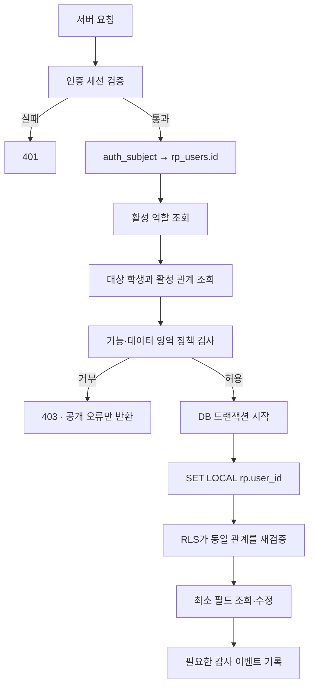

# RP APP 인증·권한 설계

**버전:** 0.1
**기준일:** 2026-08-01
**단계:** 인증 제공자 연결 전 서버 계약

## 1. 목적

이 문서는 로그인 구현 방법보다 로그인 이후 어떤 검사를 반드시 통과해야 하는지 정의합니다. 역할 이름만 확인하는 방식은 사용하지 않습니다. 모든 학생 데이터 요청은 사용자, 활성 역할, 활성 관계, 데이터 영역, 공개 설정을 함께 확인합니다.

## 2. 인증 경계

- 비밀번호, OAuth 토큰, 복구 코드는 RP APP PostgreSQL에 저장하지 않습니다.
- 인증 제공자는 사용자를 나타내는 안정적인 `auth_subject`를 반환해야 합니다.
- 서버는 `auth_subject`를 `rp_users.id`에 매핑한 뒤 권한 검사를 시작합니다.
- 브라우저가 보낸 user ID, role, student ID를 신뢰하지 않습니다.
- 개발용 역할 전환 메뉴는 Production에서 인증·권한 수단으로 사용하지 않습니다.

## 3. 서버 요청 처리 순서



## 4. 두 겹의 권한 검사

### 1차: 서버 서비스 계층

`lib/authorizationPolicy.ts`의 순수 정책 함수를 기준으로 요청 목적과 접근 수준을 판정합니다.

- `getStudentDataAccess`: `none / summary / full`
- `canWriteStudentData`: 학생과 담당 코치의 수정 범위
- `canAccessConversation`: 실제 활성 참여자 여부
- `canManageOperations`: 관리자 운영 기능
- `getAiAccess`: 승인·만료·일일 잔여량

정책 함수에 전달하는 관계 데이터는 반드시 서버가 DB에서 조회한 값이어야 합니다.

### 2차: PostgreSQL RLS

`0004_authorization_rls.sql`은 다음 조건을 DB에서 다시 검사합니다.

- 학생 본인
- 활성 학생-코치 관계
- 학생이 확인한 활성 학생-학부모 관계
- 항목별 학부모 공개 설정
- 대화방의 활성 참여자
- 관리자 역할과 운영 범위
- AI 기능별 승인·만료·일일 한도

RLS는 서버 정책의 대체물이 아니라 실수나 누락에 대비한 두 번째 방어선입니다.

## 5. 요청 컨텍스트 설정

서버는 인증이 완료된 요청마다 DB 트랜잭션 안에서 다음 값을 설정합니다.

```sql
BEGIN;
SELECT set_config('rp.user_id', $1, true);
-- Parameterized queries only.
COMMIT;
```

`true`는 트랜잭션 로컬 설정을 의미합니다. 연결 풀에서 이전 사용자의 ID가 다음 요청으로 누출되지 않게 모든 쿼리를 같은 트랜잭션 안에서 실행합니다.

중요한 운영 조건:

- Migration 역할과 Runtime 역할을 분리합니다.
- Runtime 역할은 테이블 소유자이거나 `BYPASSRLS` 권한을 가지면 안 됩니다.
- Runtime DB 자격증명은 브라우저나 공개 환경변수에 노출하지 않습니다.
- 인증되지 않은 요청은 `rp.user_id`를 설정하지 않습니다.

## 6. 학생 데이터 접근 수준

| 요청자 | 관계 | 결과 |
|---|---|---|
| 학생 | 본인 | 계약 원본을 제외한 본인 데이터 `full` |
| 코치 | 활성 담당 관계 | 코칭 목적 데이터 `full`, 쓰기는 과제·실기·일정으로 제한 |
| 학부모 | 학생 확인 관계 + 항목 공개 | 허용 항목의 `summary`만 제공 |
| 관리자 | 운영 역할 | 프로필·계약 진행 메타데이터 `summary`, 원문 기본 금지 |
| 관계 없음 | 없음 | `none` |

학부모에게는 기본 테이블을 직접 조회하게 하지 않고, 서버가 필요한 필드만 집계한 요약 DTO를 반환합니다.

## 7. 대화 권한

- 대화 조회와 메시지 전송은 `rp_conversation_participants`의 활성 참여자만 허용합니다.
- 새 대화방은 `rp_create_conversation`을 통해서만 생성하고, 활성 학생-코치 또는 학생이 확인한 학부모-코치 관계를 다시 검사합니다.
- 메시지 저장 후 `rp_create_message_receipts` 트리거가 참여자별 읽음 상태를 생성합니다.
- 학생-코치 대화에 학부모를 자동 추가하지 않습니다.
- 관리자도 일반 운영 화면에서는 메시지 원문을 읽지 않습니다.
- 안전·보안 사건의 예외 접근은 별도 break-glass 절차와 사유·시각·접근자 감사를 필요로 합니다.
- 메시지 본문은 `body_ciphertext`로 저장하며 암호화 키는 DB와 분리합니다.

## 8. AI 권한과 비용 통제

AI 호출 전 순서:

1. 인증 사용자 확인
2. 기능별 `approved` 상태 확인
3. 만료 시각 확인
4. `rp_reserve_ai_usage(feature)`로 일일 1회 원자적 예약
5. 민감정보 최소화
6. 모델 호출
7. 토큰·비용 메타데이터 기록

AI 승인이 없거나 한도를 모두 사용해도 직접 메시지, 직접 일정 등록, 기록 기능은 계속 사용합니다.

## 9. 관리자 예외 접근

관리자가 기본적으로 할 수 있는 일:

- 계정 상태와 역할 관리
- 학생-코치·학생-학부모 관계 승인·종료
- AI 기능별 승인·일일 한도 관리
- 동의 상태와 감사 이벤트 확인
- 계약·결제 진행 상태 관리

기본적으로 할 수 없는 일:

- 학생-코치 메시지 원문 상시 조회
- 멘탈·건강·성적 상세 원문 탐색
- AI 질문·응답 원문 일괄 조회
- NORE 데이터 조회·전송

## 10. 계정 생성과 초대 처리

일반 Runtime 역할에는 `rp_users`, 역할, 프로필, 관계 테이블을 임의로 생성하는 권한을 주지 않습니다. 가입, 코치 승인, 학부모 초대 연결은 인증 제공자의 검증 결과를 받은 뒤 다음 중 하나의 제한된 경로로 처리합니다.

- 별도 Provisioning 역할을 사용하는 서버 전용 작업
- 입력값과 호출 주체를 내부에서 다시 검사하는 `SECURITY DEFINER` 함수

Provisioning 자격증명은 일반 요청 처리 자격증명과 분리하고 브라우저에 노출하지 않습니다. 인증 제공자와 미성년자 확인 정책이 확정되기 전에는 구체적인 `GRANT`나 가입 함수를 추가하지 않습니다.

## 11. 인증 제공자 선택 전에 확정할 사항

- 학생이 이메일 또는 휴대전화 중 무엇으로 가입하는지
- 미성년자 계정의 본인 확인과 법정대리인 동의 방식
- 코치 계정 승인 주체와 탈퇴·담당 종료 절차
- 학부모 초대 코드 만료 시간과 재사용 금지 방식
- 관리자 강제 로그아웃·다중 인증 정책
- 계정 삭제 후 보관이 필요한 법적 데이터 범위
