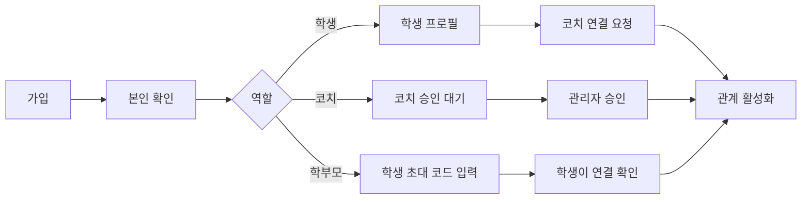
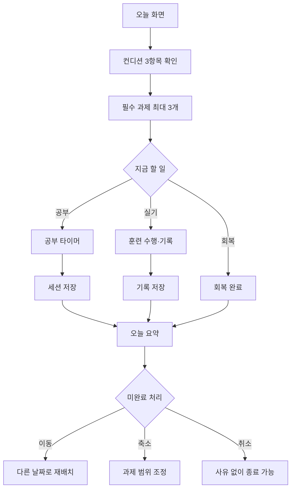
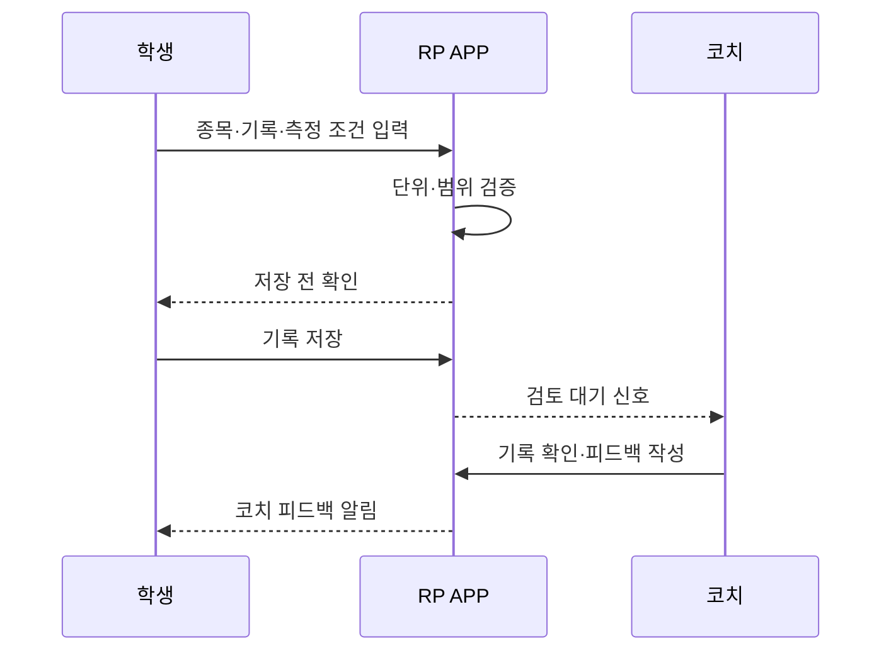
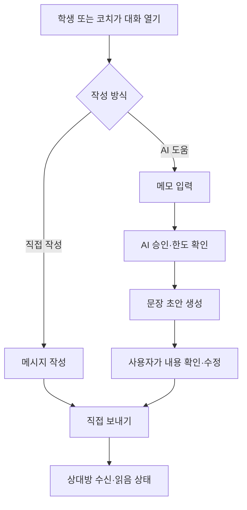
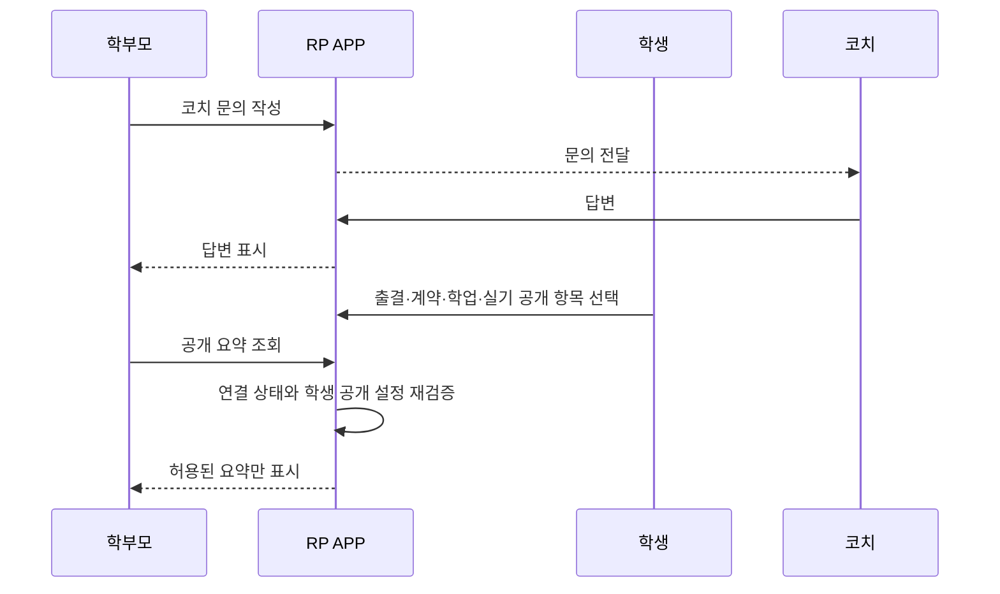
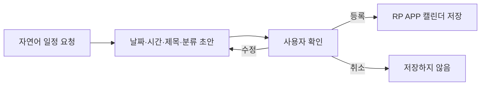
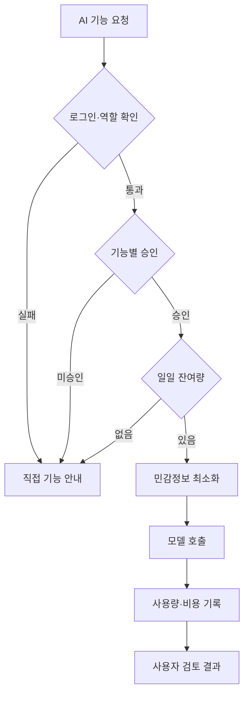

# RP APP 핵심 사용자 흐름

**버전:** 0.1
**기준일:** 2026-08-01
**목적:** 기능 화면보다 먼저 역할, 상태 변화, 확인 단계를 정의합니다.

## 1. 가입과 역할 연결

완료 조건:

- 역할과 활성 관계가 모두 확인되어야 상대 데이터에 접근합니다.
- 학부모 연결만으로 학생 정보가 자동 공개되지 않습니다.
- 개발용 역할 전환 메뉴는 Production에서 제거하거나 관리자 미리보기로 제한합니다.

## 2. 학생의 하루 흐름

핵심 규칙:

- 미완료를 실패나 벌점으로 표시하지 않습니다.
- 컨디션이 낮으면 과제 수 또는 강도를 낮추는 선택을 제공합니다.
- 코치 배정 과제를 학생이 임의 삭제하는 대신 재조정 요청으로 보냅니다.

## 3. 실기 기록과 코치 피드백

기록에는 종목 코드, 값, 단위, 측정일, 측정 조건과 검증자를 분리해 저장합니다. 서로 다른 거리나 장비로 측정한 값은 같은 기준으로 자동 합치지 않습니다.

## 4. 학생-코치 대화와 선택형 AI

안전 규칙:

- AI는 자동 발송하지 않습니다.
- 승인 또는 잔여 한도가 없어도 직접 메시지는 계속 사용할 수 있습니다.
- 통증·위기 신호가 포함되면 일반 조언을 계속하기보다 사람 확인을 우선합니다.
- 학부모는 이 대화 원문을 자동으로 볼 수 없습니다.

## 5. 학부모 문의와 선택 공개

공개 설정 변경은 변경 전·후 값과 학생 사용자 ID를 감사 이벤트로 남깁니다.

## 6. 자연어 일정 등록

- AI 또는 규칙 기반 해석기는 확인 없이 일정을 확정하지 않습니다.
- 성적·건강·상담 원문은 일정 제목에 넣지 않습니다.
- 외부 Calendar 연동은 별도 동의와 중복 방지 정책을 확정한 뒤 진행합니다.

## 7. AI 승인과 일일 한도

관리자는 승인 상태와 사용량을 관리하지만 기본 화면에서 질문 원문을 보지 않습니다.

## 8. 입시 상담 흐름

`대학정보 확인 → 목표 대학·학과 선택 → 성적·실기 상태 정리 → 질문 정리 → AI 또는 코치 검토 → 다음 준비 행동`

- AI는 합격 보장이나 최종 지원 결정을 하지 않습니다.
- 모집요강과 대학 정보에는 출처와 기준일을 표시합니다.
- 학생부·면접처럼 정량화가 어려운 요소는 불확실성을 명확히 표시합니다.

## 9. 자세분석 흐름: 2단계

`촬영 가이드 확인 → 이미지·영상 동의 → 업로드 → 자동 관찰 초안 → 코치 검토 → 학생에게 요약 제공 → 원본 보관 또는 삭제`

도입 전 선행 조건:

- 촬영 기준과 지원 동작 범위
- 얼굴·배경 비식별화 정책
- 원본 영상 보관 기간과 삭제 요청
- 분석 한계 고지와 코치 최종 검토
- 기능별 AI·영상 비용 한도

## 10. 운영 예외 흐름

| 예외 | 처리 |
|---|---|
| 학생-코치 관계 종료 | 새 데이터 접근 차단, 기존 기록 보관 정책 적용 |
| 학부모 연결 해제 | 공개 요약 즉시 차단, 문의 기록 보관 정책 적용 |
| AI 승인 중지 | 직접 기록·대화는 유지, AI 호출만 차단 |
| 메시지 전송 실패 | 제한된 재시도와 명확한 실패 표시 |
| 통증·멘탈 위기 신호 | 자동 조언 중지, 코치·보호자·전문 도움 연결 정책 적용 |
| 삭제 요청 | 법적 보관 항목을 분리하고 처리 상태를 사용자에게 표시 |
