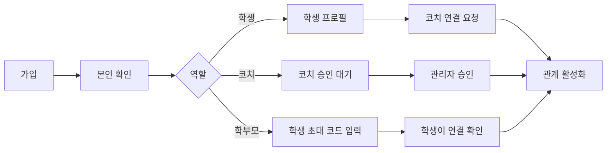
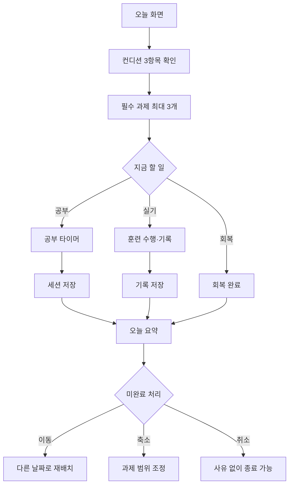
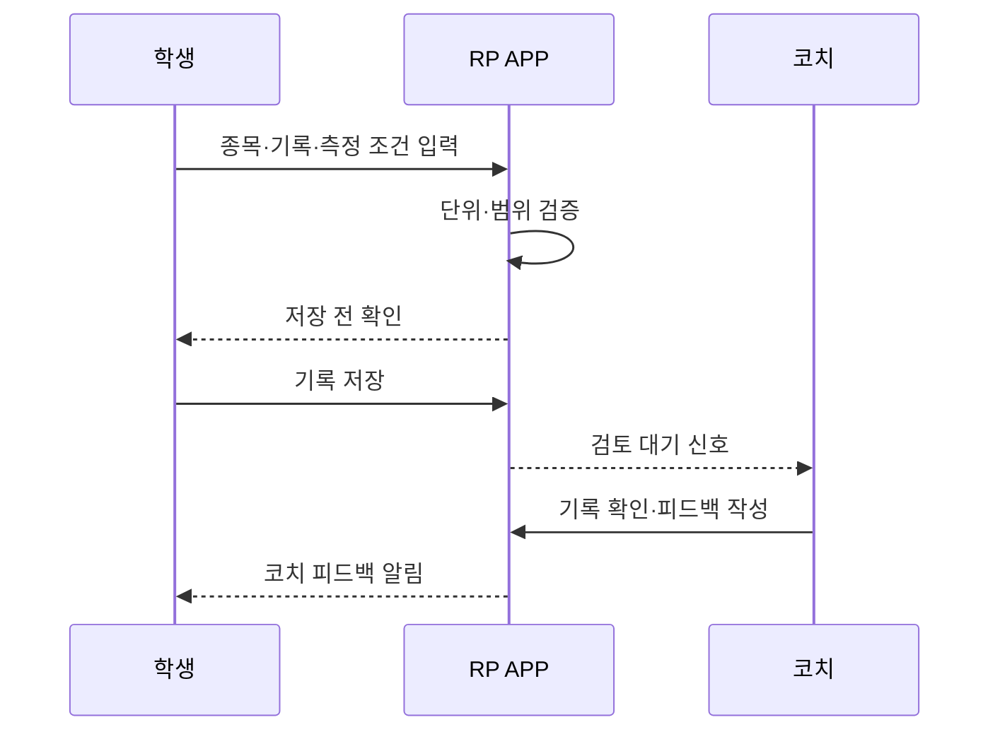
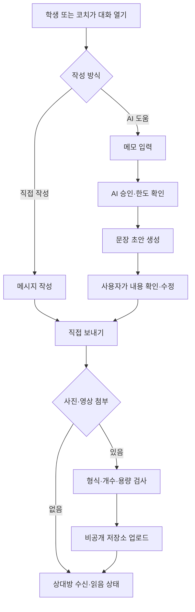
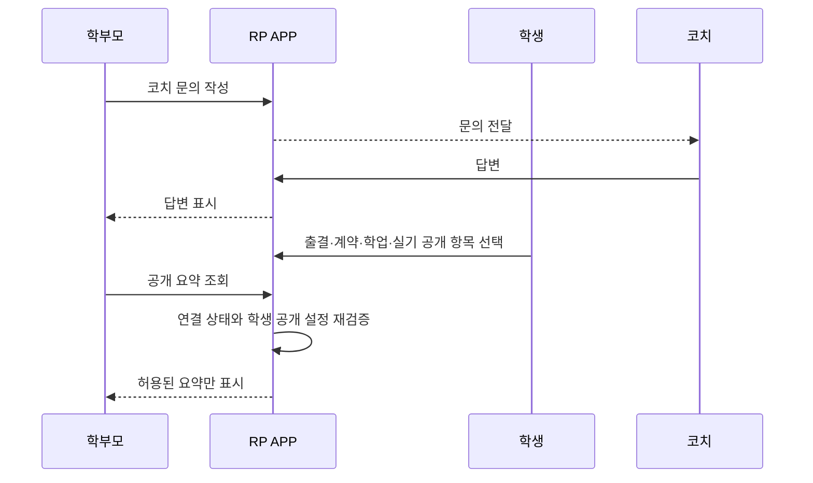
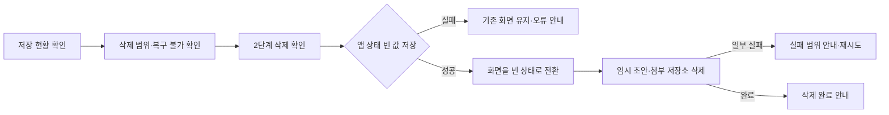
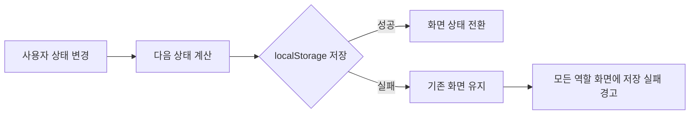
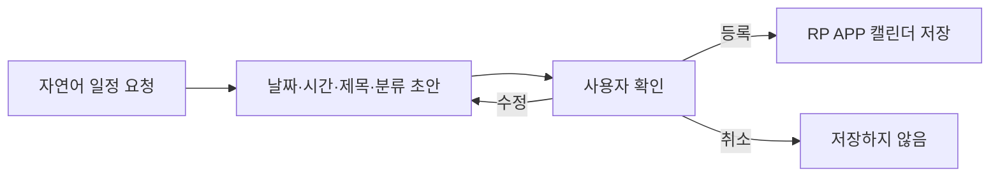
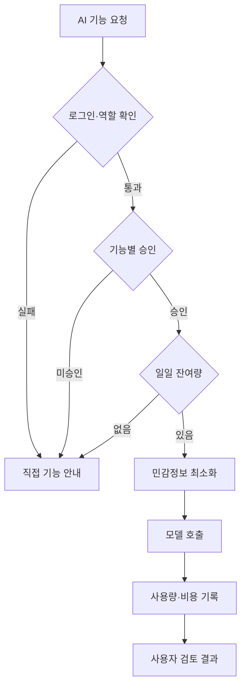

# RP APP 핵심 사용자 흐름

**버전:** 0.2
**기준일:** 2026-08-09
**목적:** 기능 화면보다 먼저 역할, 상태 변화, 확인 단계를 정의합니다.

## 1. 가입과 역할 연결

완료 조건:

- 역할과 활성 관계가 모두 확인되어야 상대 데이터에 접근합니다.
- 학부모 연결만으로 학생 정보가 자동 공개되지 않습니다.
- 개발용 역할 전환 메뉴는 Production에서 제거하거나 관리자 미리보기로 제한합니다.

## 2. 학생의 하루 흐름

핵심 규칙:

- 미완료를 실패나 벌점으로 표시하지 않습니다.
- 컨디션이 낮으면 과제 수 또는 강도를 낮추는 선택을 제공합니다.
- 코치 배정 과제를 학생이 임의 삭제하는 대신 재조정 요청으로 보냅니다.

## 3. 공부·운동·컨디션 기록과 코치 피드백

기록에는 종목 코드, 값, 단위, 측정일, 측정 조건과 검증자를 분리해 저장합니다. 서로 다른 거리나 장비로 측정한 값은 같은 기준으로 자동 합치지 않습니다.

학생 기록은 `공부 / 운동 / 컨디션` 세 범주로 나눕니다.

- 공부 타이머와 오늘 상태 저장처럼 앱 안에서 수행한 행동은 출처와 함께 자동 기록합니다.
- 앱 밖에서 수행한 공부·훈련·회복은 실제 수행 시각, 값, 단위, 메모를 학생이 직접 입력할 수 있습니다.
- 학생은 필요한 기록 항목을 추가할 수 있지만 기존 시스템 항목의 의미나 단위를 덮어쓰지는 않습니다.
- 직접 입력한 기록은 자동 측정이나 코치 검증 기록과 구분해 표시합니다.
- 수동 기록을 공부 시간, 출결 또는 코치 검증 기록으로 소급 인정하지 않습니다.
- 시스템 항목은 항목별 허용 범위·소수 자릿수·고정 단위를 적용하고, 사용자 항목은 이름과 기본 단위를 필수로 합니다.
- 존재하지 않거나 비활성인 항목, 미래 수행 시각, 잘못된 달력 날짜, 지수 표기·무한대·범위 밖 숫자는 UI와 저장 경계에서 모두 거부합니다.
- 이전 버전에서 이미 저장된 이상 기록은 자동 삭제하거나 정상값으로 수정하지 않습니다. `검토 필요` 상태로 격리하고 코치 요약 계산에서 제외한 뒤, 후속 수정·감사 흐름에서 사용자가 확인합니다.

## 4. 학생-코치 대화와 선택형 AI

안전 규칙:

- AI는 자동 발송하지 않습니다.
- 승인 또는 잔여 한도가 없어도 직접 메시지는 계속 사용할 수 있습니다.
- 통증·위기 신호가 포함되면 일반 조언을 계속하기보다 사람 확인을 우선합니다.
- 학부모는 이 대화 원문을 자동으로 볼 수 없습니다.
- 사진과 영상은 메시지당 최대 4개로 제한하고, 파일 원본은 PostgreSQL이 아닌 비공개 객체 저장소에 보관합니다.
- 프로토타입은 개수·용량·MIME 검증 뒤 JPEG·PNG·GIF·WebP·WebM·MP4·MOV 시그니처를 확인하며, 선택 시점과 IndexedDB 저장 직전에 같은 검증을 실행합니다. 이는 서버의 magic byte·디코딩·악성 파일 검사를 대신하지 않습니다.
- IndexedDB 원본 저장 후 메시지 상태를 localStorage에 먼저 영속화합니다. 상태 저장이 실패하면 해당 작업에서 만든 원본만 보상 삭제하고, 보상 삭제도 실패하면 사용자에게 기기 데이터 정리 재시도를 안내합니다.
- 앱 시작 시 복원된 메시지 메타데이터의 참조 목록과 IndexedDB 키를 비교해 참조 없는 원본을 삭제합니다. 반대로 원본이 없거나 크기·MIME·종류·시그니처가 다른 참조는 자동 대체하지 않고 화면에서 표시를 차단합니다.
- 첨부파일은 대화 참여자만 단기 접근 주소로 열 수 있으며, 미디어 동의·보관 기간·삭제 요청을 적용합니다.
- AI 문장 정리에는 사진과 영상을 보내지 않습니다. 향후 미디어 분석은 별도 동의와 승인 기능으로 분리합니다.

## 5. 학부모 문의와 선택 공개

공개 설정 변경은 변경 전·후 값과 학생 사용자 ID를 감사 이벤트로 남깁니다.

### 현재 기기 데이터 확인과 삭제

- 현재 프로토타입은 같은 브라우저 origin의 localStorage 앱 상태, sessionStorage 임시 초안, IndexedDB 메시지 미디어만 삭제합니다.
- 시스템 기록 항목과 앱 자체는 남기고, 학생이 만든 할 일·일정·기록·대화·첨부·공개 설정은 빈 상태로 전환합니다.
- 앱 상태를 빈 값으로 영속화하지 못하면 메모리 상태도 비우지 않습니다. 초안이나 첨부 삭제만 실패한 경우 이미 삭제한 데이터를 되살리지 않고 실패 범위를 알려 재시도하게 합니다.
- 운영 서비스의 계정 삭제는 재인증, 법적 보관 예외, 객체 저장소 삭제, 처리 감사 로그와 다른 기기 세션 폐기를 포함하는 별도 서버 흐름으로 구현해야 합니다.

### 프로토타입 상태 변경의 공통 저장 계약

- 할 일·일정·기록·컨디션·학부모 공개 설정·공부 세션·학부모 문의·학생-코치 메시지는 같은 저장 경계를 사용합니다.
- 저장 실패 시 폼을 닫거나 값을 초기화하거나 성공 문구를 표시하지 않습니다. 다음 저장이 성공하면 공통 경고를 해제합니다.
- 이 계약은 단일 브라우저 프로토타입의 데이터 유실 오해를 줄이기 위한 것입니다. 운영 서버에서는 트랜잭션, 충돌 처리, 재시도·중복 방지, 오프라인 동기화 상태가 별도로 필요합니다.

## 6. 자연어 일정 등록

- AI 또는 규칙 기반 해석기는 확인 없이 일정을 확정하지 않습니다.
- 성적·건강·상담 원문은 일정 제목에 넣지 않습니다.
- 외부 Calendar 연동은 별도 동의와 중복 방지 정책을 확정한 뒤 진행합니다.

## 7. AI 승인과 일일 한도

관리자는 승인 상태와 사용량을 관리하지만 기본 화면에서 질문 원문을 보지 않습니다.

## 8. 입시 상담 흐름

`대학정보 확인 → 목표 대학·학과 선택 → 성적·실기 상태 정리 → 질문 정리 → AI 또는 코치 검토 → 다음 준비 행동`

- AI는 합격 보장이나 최종 지원 결정을 하지 않습니다.
- 모집요강과 대학 정보에는 출처와 기준일을 표시합니다.
- 학생부·면접처럼 정량화가 어려운 요소는 불확실성을 명확히 표시합니다.

## 9. 자세분석 흐름: 2단계

`촬영 가이드 확인 → 이미지·영상 동의 → 업로드 → 자동 관찰 초안 → 코치 검토 → 학생에게 요약 제공 → 원본 보관 또는 삭제`

도입 전 선행 조건:

- 촬영 기준과 지원 동작 범위
- 얼굴·배경 비식별화 정책
- 원본 영상 보관 기간과 삭제 요청
- 분석 한계 고지와 코치 최종 검토
- 기능별 AI·영상 비용 한도

## 10. 운영 예외 흐름

| 예외 | 처리 |
|---|---|
| 학생-코치 관계 종료 | 새 데이터 접근 차단, 기존 기록 보관 정책 적용 |
| 학부모 연결 해제 | 공개 요약 즉시 차단, 문의 기록 보관 정책 적용 |
| AI 승인 중지 | 직접 기록·대화는 유지, AI 호출만 차단 |
| 메시지 전송 실패 | 제한된 재시도와 명확한 실패 표시 |
| 통증·멘탈 위기 신호 | 자동 조언 중지, 코치·보호자·전문 도움 연결 정책 적용 |
| 삭제 요청 | 법적 보관 항목을 분리하고 처리 상태를 사용자에게 표시 |
