# RP APP 데이터 모델과 ERD

**버전:** 0.3
**기준일:** 2026-08-09
**단계:** PostgreSQL 마이그레이션·RLS 설계 완료, 아직 DB 미적용

## 1. 모델링 원칙

1. 역할과 학생 관계를 분리해 한 사용자가 여러 역할을 가질 수 있게 합니다.
2. 학생 데이터 접근은 역할뿐 아니라 활성 관계와 목적을 함께 확인합니다.
3. 메시지, AI, 공개 설정, 동의 변경은 감사 가능한 상태를 남깁니다.
4. 성적·건강·상담·영상 원문은 최소 수집하고 공개 분석 이벤트에 보내지 않습니다.
5. 계약서·결제 원본은 앱 DB에 저장하지 않고 외부 원본의 진행 상태만 관리합니다.
6. NORE 식별자나 동기화 상태는 데이터 모델에 추가하지 않습니다.
7. 기록 항목 정의와 실제 기록값을 분리하고, 직접 입력·타이머·상태 저장·코치 기록의 출처를 보존합니다.

## 2. 핵심 ERD

```mermaid
erDiagram
    USERS ||--o{ USER_ROLES : has
    USERS ||--o| STUDENT_PROFILES : owns
    USERS ||--o| COACH_PROFILES : owns
    USERS ||--o| GUARDIAN_PROFILES : owns

    STUDENT_PROFILES ||--o{ COACH_STUDENT_LINKS : assigned
    COACH_PROFILES ||--o{ COACH_STUDENT_LINKS : coaches
    STUDENT_PROFILES ||--o{ GUARDIAN_STUDENT_LINKS : connected
    GUARDIAN_PROFILES ||--o{ GUARDIAN_STUDENT_LINKS : supports
    GUARDIAN_STUDENT_LINKS ||--|| GUARDIAN_SHARING_PREFERENCES : controls

    STUDENT_PROFILES ||--o{ TASKS : receives
    STUDENT_PROFILES ||--o{ CONDITION_CHECKS : records
    STUDENT_PROFILES ||--o{ STUDY_SESSIONS : records
    STUDENT_PROFILES ||--o{ ACADEMIC_SNAPSHOTS : records
    STUDENT_PROFILES ||--o{ PRACTICAL_RECORDS : records
    STUDENT_PROFILES ||--o{ CALENDAR_EVENTS : owns
    STUDENT_PROFILES ||--o{ ADMISSION_PROFILES : prepares

    CONVERSATIONS ||--o{ CONVERSATION_PARTICIPANTS : includes
    USERS ||--o{ CONVERSATION_PARTICIPANTS : joins
    CONVERSATIONS ||--o{ MESSAGES : contains
    USERS ||--o{ MESSAGES : sends
    MESSAGES ||--o{ MESSAGE_ATTACHMENTS : includes
    USERS ||--o{ MESSAGE_ATTACHMENTS : uploads
    MESSAGES ||--o{ MESSAGE_RECEIPTS : tracks
    USERS ||--o{ MESSAGE_RECEIPTS : receives

    USERS ||--o{ AI_ACCESS_GRANTS : receives
    USERS ||--o{ AI_USAGE_DAILY : consumes
    USERS ||--o{ AI_REQUESTS : requests

    USERS ||--o{ CONSENTS : grants
    USERS ||--o{ AUDIT_EVENTS : acts
    STUDENT_PROFILES ||--o| CONTRACT_STATUS_SUMMARIES : has
```

## 3. 핵심 테이블

### 계정과 관계

| 테이블 | 주요 필드 | 목적 |
|---|---|---|
| `rp_users` | id, auth_subject, status, last_login_at | 외부 인증 주체 연결, 비밀번호·토큰 미저장 |
| `rp_user_roles` | user_id, role, active_from, active_to | 학생·코치·학부모·관리자 역할 부여 |
| `rp_student_profiles` | user_id, display_name, school_year, admission_track | 학생 기본 프로필, 최소 정보만 저장 |
| `rp_coach_profiles` | user_id, display_name, status | 코치 운영 상태 |
| `rp_guardian_profiles` | user_id, display_name | 학부모 최소 프로필 |
| `rp_coach_student_links` | coach_id, student_id, status, starts_at, ends_at | 담당 코치 접근 경계 |
| `rp_guardian_student_links` | guardian_id, student_id, status, relationship_label | 학부모 연결 경계 |
| `rp_guardian_sharing_preferences` | link_id, attendance, contract, academics, practical, updated_by_student_at | 학생 선택 공개 상태 |

### 공부·실기·컨디션·일정

| 테이블 | 주요 필드 | 목적 |
|---|---|---|
| `rp_tasks` | student_id, kind, title, scheduled_at, duration, status, assigned_by | 오늘 할 일과 코치 과제 |
| `rp_condition_checks` | student_id, energy, focus, soreness, checked_at | 짧은 컨디션 체크 |
| `rp_study_sessions` | student_id, subject, goal, focused_minutes, status, completed_at | 공부 타이머 결과 |
| `rp_academic_snapshots` | student_id, assessment_type, subject, score_band, recorded_at | 상담에 필요한 성적 상태 스냅샷 |
| `rp_practical_records` | student_id, event_code, value, unit, measured_at, verified_by | 실기 종목 기록과 검증 상태 |
| `rp_calendar_events` | student_id, category, starts_at, ends_at, source, status | 공부·실기·상담·시험·회복 일정 |
| `rp_admission_profiles` | student_id, target_year, track, target_departments, updated_at | 입시 상담의 목표와 준비 기준 |

현재 로컬 프로토타입은 `recordItems`와 `studentRecords`로 사용자 정의 항목과 통합 기록 흐름을 검증합니다. 중앙 기록 검증 모듈이 시스템 항목별 숫자 범위·소수 자릿수·고정 단위와 사용자 항목의 이름·단위·중복·개수, 수동 기록의 미래 시각을 UI와 상태 변경 경계에서 함께 검사합니다. 이전 버전의 이상 기록은 삭제하지 않고 `validationStatus=needs_review`로 표시해 코치 요약에서 제외합니다. 운영 DB에서는 기존 `rp_study_sessions`, `rp_condition_checks`, `rp_academic_snapshots`, `rp_practical_records`를 최종 도메인 기록으로 유지하고, 사용자 정의 항목 카탈로그·수동 입력 출처·검토 상태를 연결할 별도 마이그레이션을 설계한 뒤 적용합니다. 프로토타입의 범용 문자열 값을 검증 없이 운영 DB에 그대로 복제하지 않습니다.

### 대화와 AI

| 테이블 | 주요 필드 | 목적 |
|---|---|---|
| `rp_conversations` | id, type, student_id, status | 학생-코치 또는 학부모-코치 대화방 |
| `rp_conversation_participants` | conversation_id, user_id, role, joined_at, left_at | 실제 참여자 접근 제어 |
| `rp_messages` | conversation_id, sender_id, body_ciphertext, sent_at, ai_assisted | 애플리케이션 암호화를 전제로 한 메시지 |
| `rp_message_attachments` | message_id, uploader_user_id, kind, object_key, mime_type, byte_size, checksum, retention_until | 비공개 객체 저장소의 사진·영상 메타데이터 |
| `rp_message_receipts` | message_id, recipient_user_id, delivered_at, read_at | 수신자별 전달·읽음 상태 |
| `rp_ai_access_grants` | user_id, feature, status, daily_request_limit, approved_by | 기능별 AI 승인과 한도 |
| `rp_ai_usage_daily` | user_id, feature, usage_date, request_count, token_count, cost_amount | 일별 비용·사용량 통제 |
| `rp_ai_requests` | user_id, feature, status, input_redaction_level, model, created_at | 원문 없는 AI 요청 감사 메타데이터 |

### 동의·운영

| 테이블 | 주요 필드 | 목적 |
|---|---|---|
| `rp_consents` | user_id, type, version, status, granted_at, revoked_at | 개인정보·민감정보·AI·영상 동의 |
| `rp_contract_status_summaries` | student_id, product_name, session_count, contract_status, payment_status, first_session_at, external_ref | 외부 원본을 복제하지 않는 진행 상태 |
| `rp_audit_events` | actor_user_id, action, target_type, target_id, reason_code, occurred_at | 권한·동의·공개·민감 접근 추적 |

## 4. 2단계 확장 모델

다음 모델은 핵심 기록 루프가 검증된 뒤 추가합니다.

| 영역 | 후보 테이블 | 선행 조건 |
|---|---|---|
| 자세분석 | `posture_analysis_jobs`, `media_assets`, `analysis_observations`, `coach_reviews` | 영상 동의, 저장소, 삭제 정책, 코치 검토 |
| 식단 지원 | `nutrition_checkins`, `meal_patterns` | 질환·알레르기·섭식 위험 제외 정책 |
| 멘탈 지원 | `wellbeing_checkins`, `escalation_events` | 위기 대응 프로토콜과 전문가 검토 |
| 장기 분석 | `weekly_summaries`, `training_load_snapshots` | 데이터 품질과 실제 사용 검증 |

## 5. 상태 모델

### 관계 상태

`invited → active → paused → ended`

### 메시지 상태

`created → sent → delivered → read`
실패 상태는 `failed`로 분리하고 재시도 횟수를 제한합니다.

### AI 승인 상태

`pending → approved → suspended → revoked`

### 과제 상태

`planned → in_progress → completed` 또는 `rescheduled / cancelled`

## 6. 최종 관리 기준

| 정보 | 최종 기준 |
|---|---|
| 계정, 관계, 권한, 상담 전·앱 기록 | RP APP PostgreSQL |
| 계약서·개인정보 동의서·결제 원본 | Google Workspace |
| 외부 확정 방문·수업 일정 | Calendar |
| 계약 이후 기존 고객관리 | NORE 별도 운영, 기술 연동 없음 |

## 7. 마이그레이션 파일

| 순서 | 파일 | 범위 |
|---:|---|---|
| 1 | `0001_identity_and_relationships.sql` | 계정, 역할, 프로필, 학생 관계, 학부모 공개 설정 |
| 2 | `0002_student_workflows.sql` | 과제, 컨디션, 공부, 성적, 실기, 일정, 입시, 계약 상태 |
| 3 | `0003_messaging_ai_and_audit.sql` | 대화, 메시지, 읽음, AI 승인·사용량, 동의, 감사 |
| 4 | `0004_authorization_rls.sql` | 활성 관계 함수, AI 원자적 한도, RLS 정책 |
| 5 | `0005_message_attachments.sql` | 메시지 사진·영상 메타데이터, 미디어 동의, 참여자 RLS 정책 |

마이그레이션 원본은 `database/migrations`에 있으며 아직 어떤 DB에도 적용하지 않았습니다.

## 8. DB 적용 전 확인사항

- 인증 제공자와 사용자 식별자 정책
- 미성년자 동의와 법정대리인 예외 범위
- 성적·건강·메시지·영상의 보관 기간과 삭제 방식
- 계정 삭제 재인증, 법적 보관 예외, 다른 기기 세션 폐기, 객체 저장소 삭제와 처리 감사 로그
- 메시지 암호화 범위와 운영자 접근 절차
- 메시지 미디어용 비공개 객체 저장소, 단기 서명 URL, 악성 파일 검사와 삭제 정책
- 업로드 서버의 magic byte·완전 디코딩·악성 파일 검사, EXIF·위치정보 제거와 검증 전 `pending` 격리
- DB 메시지·첨부 메타데이터와 객체 저장소 원본을 연결하는 업로드 세션, idempotency key, 보상 삭제·고아 객체 정리 작업
- AI 제공자에게 전송할 최소 필드와 비식별화 방식
- Migration 역할과 Runtime 역할의 분리 및 Runtime `BYPASSRLS` 금지
- 테스트 PostgreSQL에서 전체 마이그레이션 구문·정책 실행 검증
