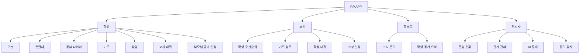

# RP APP 정보구조와 화면 체계

**버전:** 0.2
**기준일:** 2026-08-02
**목적:** 디지털 피로도를 낮추면서 학생·코치·학부모·관리자가 자신의 다음 행동을 빠르게 찾는 화면 구조를 정의합니다.

## 1. 정보구조 원칙

1. 각 역할의 기능 목록은 기본 화면에서 숨기고 목록 아이콘으로 여는 사이드바에 모읍니다.
2. 첫 화면은 전체 데이터가 아니라 오늘 필요한 행동과 예외 신호를 보여줍니다.
3. 공부·실기·상담 원문은 한 화면에 모두 펼치지 않고 요약에서 상세로 이동합니다.
4. 직접 대화와 AI 도움을 분리하며 AI는 기본 진입점이 아닙니다.
5. 학부모 화면은 문의와 학생 공개 요약을 분리합니다.
6. 관리자 화면은 학생용 앱과 분리된 운영 화면으로 취급합니다.

## 2. 역할별 1차 내비게이션

### 학생: 7개

| 메뉴 | 경로 | 첫 질문 | 포함 범위 |
|---|---|---|---|
| 오늘 | `/student` | 오늘 무엇을 하면 되는가? | 상태 저장, 공부·운동·회복 완료, RP AI 도우미 |
| 캘린더 | `/calendar` | 공부와 운동 일정이 어떻게 이어지는가? | 주간·월간 일정, 선택 날짜 편집, 일정 도우미 |
| 공부 타이머 | `/student/study` | 지금 어떤 공부를 시작할 것인가? | 과목, 목표, 집중·휴식, 세션 기록 |
| 기록 | `/student/records` | 공부와 실기가 실제로 어떻게 변하고 있는가? | 학업, 실기, 컨디션, 최근 변화 |
| 상담 | `/student/consultation` | 지금 누구에게 어떤 도움을 요청해야 하는가? | 입시, 운동, 식단, 멘탈, 자세분석 진입 |
| 코치 대화 | `/student/messages` | 담당 코치에게 무엇을 전달할 것인가? | 직접 작성, 선택형 AI 초안, 답장 |
| 공개 설정 | `/student/privacy` | 부모님에게 무엇을 공개할 것인가? | 출결, 계약·결제, 학업, 실기 선택 공개 |

### 코치: 4개

| 메뉴 | 경로 | 첫 질문 | 포함 범위 |
|---|---|---|---|
| 학생 | `/coach` | 오늘 개입해야 할 학생은 누구인가? | 우선순위, 위험 신호, 답장 대기 |
| 기록 | `/coach/records` | 어떤 기록을 확인하고 피드백해야 하는가? | 학업·실기·컨디션 변화, 검토 상태 |
| 대화 | `/coach/messages` | 어떤 학생에게 답장이 필요한가? | 학생 대화, 직접 답장, 선택형 AI 초안 |
| 일정 | `/coach/calendar` | 수업과 측정 일정을 어떻게 조정할 것인가? | 코칭 일정, 학생 일정 조회, 일정 제안 |

### 학부모: 2개

| 메뉴 | 경로 | 첫 질문 | 포함 범위 |
|---|---|---|---|
| 문의 | `/guardian` | 코치에게 무엇을 물어볼 것인가? | 문의 작성, 답변 상태 |
| 공개 요약 | `/guardian/summary` | 학생이 어떤 정보를 공유했는가? | 출결, 계약·결제, 학업, 실기 조건부 요약 |

### 관리자: 4개

| 메뉴 | 경로 | 첫 질문 | 포함 범위 |
|---|---|---|---|
| 운영 현황 | `/admin` | 지금 처리할 운영 예외가 무엇인가? | 연결 대기, AI 승인, 보안·동의 알림 |
| 관계 관리 | `/admin/relations` | 계정과 학생 관계가 올바른가? | 역할, 초대, 학생-코치·학생-학부모 연결 |
| AI 통제 | `/admin/ai` | 누가 어떤 AI를 얼마나 사용할 수 있는가? | 승인, 기능별 허용, 일일 한도, 사용량 |
| 감사 | `/admin/audit` | 민감한 변경과 접근이 추적되는가? | 동의, 공개 설정 변경, 권한·보안 이벤트 |

## 3. 전체 사이트맵

## 4. 학생 상담 허브 구조

상담은 기능을 한 화면에 펼치는 대시보드가 아니라 목적을 선택하는 진입점입니다.

| 상담 유형 | 기본 입력 | 결과 | 사람의 최종 역할 |
|---|---|---|---|
| 입시 상담 | 목표 대학·학과, 성적, 실기 기록, 질문 | 현재 상태와 준비 질문 정리 | 코치가 지원 방향 검토 |
| 운동 상담 | 현재 프로그램, 기록, 통증 여부, 질문 | 훈련 질문과 확인 항목 정리 | 코치가 운동 방향 결정 |
| 식단 상담 | 생활 일정, 운동량, 식사 패턴 | 생활 수준의 질문 정리 | 위험·질환은 전문가 연결 |
| 멘탈 지원 | 현재 부담, 도움 요청 대상 | 감정 정리와 도움 요청 문장 | 위기 신호는 사람에게 즉시 연결 |
| 자세분석 | 정적 사진 또는 기준 동작 영상 | 참고 관찰과 코치 검토 항목 | 코치가 최종 해석 |

## 5. 디지털 피로도 제한 규칙

- 오늘 화면의 필수 과제는 기본 3개를 넘기지 않습니다.
- 홈의 주요 영역은 상태·할 일·RP AI 도우미 세 개로 제한합니다.
- 기록 화면은 `최근 변화 → 세부 기록` 순서로 이동합니다.
- 알림은 일정, 코치 답장, 안전 확인처럼 행동이 필요한 경우만 기본 허용합니다.
- 연속 수행, 순위, 비교, 벌점, 과도한 통계는 사용하지 않습니다.
- 홈의 일정 요청은 날짜와 시간이 모두 확인된 경우에만 자동 등록하며 즉시 삭제할 수 있어야 합니다. 메시지는 항상 사용자가 확인한 뒤 보냅니다.

## 6. 시스템 경계

- 공개 RePERFORMANCE 홈페이지: 유입, 서비스 안내, 체대입시 공개 정보, 상담 신청
- RP APP: 학생·코치·학부모의 공부·실기·일정·상담 관리
- Google Workspace: 계약서·결제 원본
- Calendar: 외부 확정 일정이 필요할 때의 운영 기준
- NORE: 별도 고객관리 도구로 운영하며 기술 연동 없음
